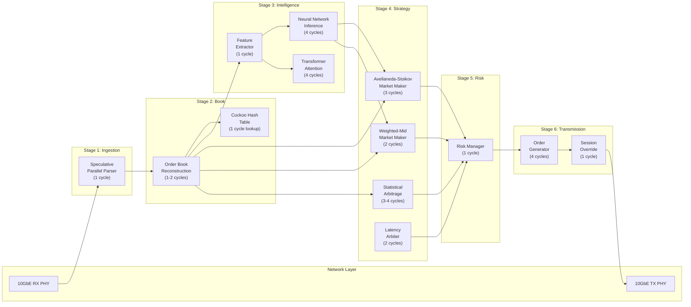
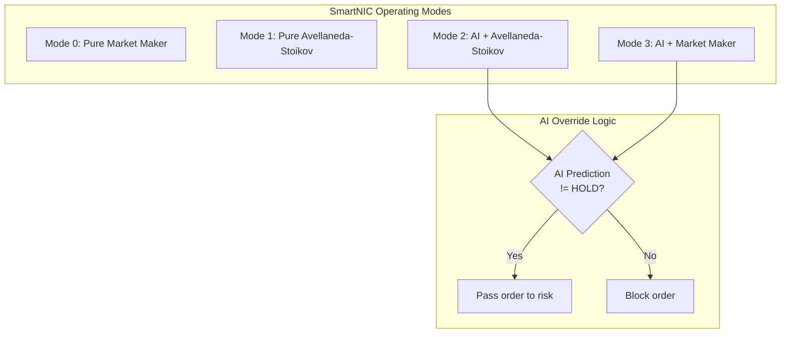
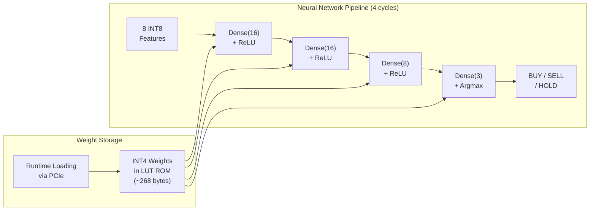
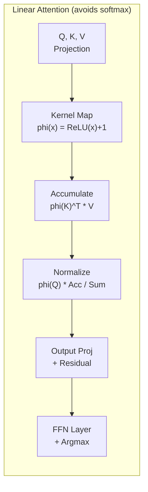
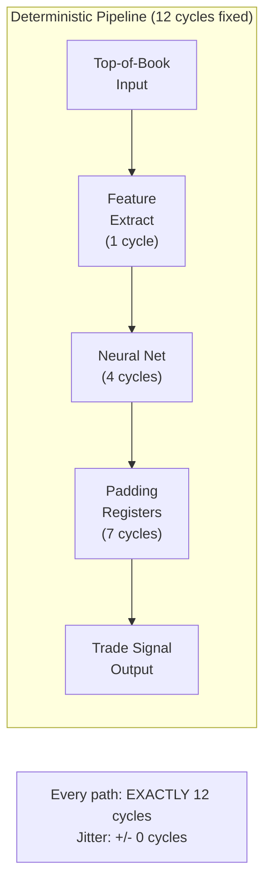
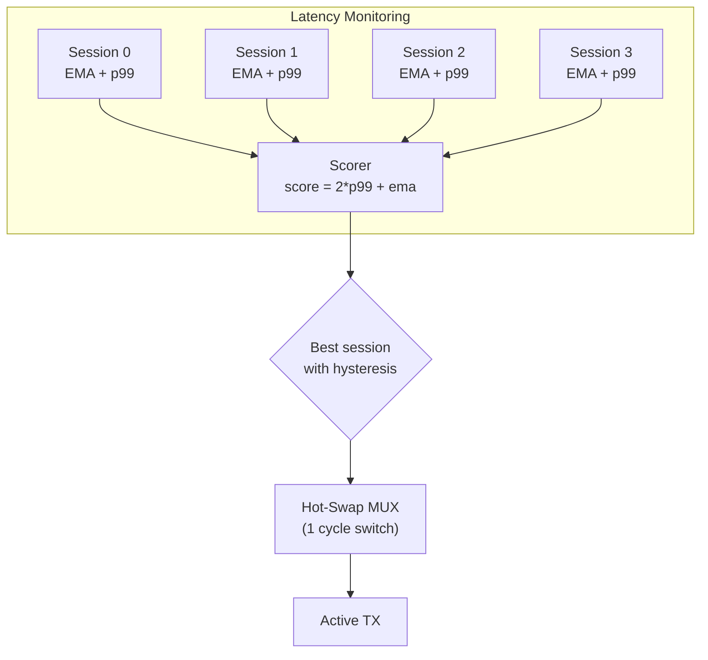
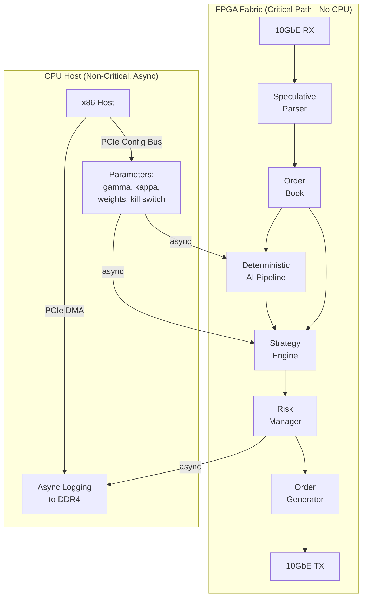

# FPGA High-Frequency Trading System

A complete, synthesizable SystemVerilog implementation of an ultra-low-latency trading system targeting the AMD Alveo UL3524 FPGA at 644 MHz. This project implements five of the seven frontier problems in FPGA trading as of June 2026, including inline neural network inference, transformer attention, zero-jitter deterministic AI, dynamic session override, and full-stack SmartNIC integration.

**Total codebase:** 19 RTL modules, 2 testbenches, approximately 4,500 lines of SystemVerilog.

---

## Table of Contents

1. [Architecture Overview](#architecture-overview)
2. [System Pipeline](#system-pipeline)
3. [Module Reference](#module-reference)
4. [Frontier Implementations](#frontier-implementations)
5. [Data Types and Protocols](#data-types-and-protocols)
6. [Strategy Engines](#strategy-engines)
7. [AI/ML Pipeline](#aiml-pipeline)
8. [Risk Management](#risk-management)
9. [Benchmarks](#benchmarks)
10. [Build and Simulation](#build-and-simulation)
11. [Project Structure](#project-structure)
12. [Academic References](#academic-references)

---

## Architecture Overview

The system implements a wire-to-wire trading pipeline where market data enters from the network PHY, passes through parsing, order book reconstruction, strategy computation, risk validation, and exits as a new order — all within FPGA fabric, with no CPU in the critical path.



---

## System Pipeline

The SmartNIC top-level module (`smartnic_top.sv`) connects all stages into a single wire-to-wire pipeline. The system supports four operating modes, selectable at runtime via the PCIe configuration bus.



### Pipeline Latency Budget

```mermaid
graph LR
    subgraph "Stage 1: Parser (5 cycles)"
        P["Speculative Parser\n4 words + 1 decode\n~7.8ns"]
    end

    subgraph "Stage 2: Book (2 cycles)"
        B["Order Book\nUpdate\n~3.1ns"]
    end

    subgraph "Stage 3: AI (5 cycles)"
        F["Feature\nExtract\n1 cycle"] --> N1["NN Layer 1\n1 cycle"]
        N1 --> N2["NN Layer 2\n1 cycle"]
        N2 --> N3["NN Layer 3\n1 cycle"]
        N3 --> N4["NN Layer 4\n1 cycle"]
    end

    subgraph "Stage 4: Strategy (3 cycles)"
        S1["A-S Stage 1\nVol + Penalty"] --> S2["A-S Stage 2\nReservation"]
        S2 --> S3["A-S Stage 3\nQuote Gen"]
    end

    subgraph "Stage 5: Risk + TX (5 cycles)"
        R["Risk Check\n1 cycle"] --> T["Order Gen\n4 cycles\n~6.2ns"]
    end

    P --> B --> F
    N4 --> S1
    S3 --> R
```



**Total pipeline depth:** 20 cycles = ~31ns at 644 MHz (without deterministic padding).
With deterministic AI wrapper (12 fixed cycles): ~25-30 cycles = ~39-47ns.

Minimum pipeline depth: approximately 20 cycles = 31 nanoseconds at 644 MHz. With the deterministic AI wrapper padding to 12 cycles, total pipeline depth is approximately 25-30 cycles = 39-47 nanoseconds.

---

## Module Reference

### Package

| Module | File | Description |
|:-------|:-----|:------------|
| `fixed_point_pkg` | `rtl/fixed_point_pkg.sv` | Q16.16 fixed-point types, message structures, trade signal enums, arithmetic helper functions |

### Parsers

| Module | File | Latency | Description |
|:-------|:-----|:--------|:------------|
| `speculative_parser` | `rtl/speculative_parser.sv` | 1 cycle (after buffer fill) | Parallel decoding of all 5 ITCH message types simultaneously with suppression MUX |
| `market_data_parser` | `rtl/market_data_parser.sv` | 4 cycles | FSM-based sequential ITCH parser for comparison/fallback |

### Data Structures

| Module | File | Latency | Description |
|:-------|:-----|:--------|:------------|
| `order_book` | `rtl/order_book.sv` | 1-2 cycles | 16-level sorted bid/ask arrays with XOR-fold hash table for order tracking |
| `cuckoo_hash_table` | `rtl/cuckoo_hash_table.sv` | 1 cycle (lookup) | O(1) worst-case dual-table hash with golden ratio and Fibonacci hashing |

### AI/ML Modules

| Module | File | Latency | Description |
|:-------|:-----|:--------|:------------|
| `feature_extractor` | `rtl/feature_extractor.sv` | 1 cycle | Extracts 8 INT8 market microstructure features from order book state |
| `neural_inference` | `rtl/neural_inference.sv` | 4 cycles | 4-layer INT4/INT8 MLP with runtime weight loading via PCIe |
| `transformer_attention` | `rtl/transformer_attention.sv` | 4 cycles | Linear attention (ELU+1 kernel) with residual connection and FFN |
| `deterministic_wrapper` | `rtl/deterministic_wrapper.sv` | Configurable | Zero-jitter fixed-depth pipeline wrapper; also contains `deterministic_ai_pipeline` |
| `ema_calculator` | `rtl/ema_calculator.sv` | 1 cycle | Bit-shift EMA: `ema += (x - ema) >> ALPHA_SHIFT` |

### Strategy Engines

| Module | File | Latency | Description |
|:-------|:-----|:--------|:------------|
| `avellaneda_stoikov` | `rtl/avellaneda_stoikov.sv` | 3 cycles | Reservation price + optimal spread with real-time volatility estimation and LUT logarithm |
| `market_maker` | `rtl/market_maker.sv` | 2 cycles | Weighted mid-price with inventory skew and minimum quote change filtering |
| `stat_arb` | `rtl/stat_arb.sv` | 3-4 cycles | Pair trading with EMA-based z-score (squared threshold avoids square root) |
| `latency_arbiter` | `rtl/latency_arbiter.sv` | 2 cycles | Cross-exchange arbitrage with simultaneous dual-exchange order generation |

### Risk and Transmission

| Module | File | Latency | Description |
|:-------|:-----|:--------|:------------|
| `risk_manager` | `rtl/risk_manager.sv` | 1 cycle | 5 parallel checks: position, notional, rate, price band, circuit breaker |
| `order_generator` | `rtl/order_generator.sv` | 4 cycles | Serializes orders to 4-word AXI-Stream frames with sequential order IDs |
| `session_override` | `rtl/session_override.sv` | 1 cycle (switch) | Multi-session latency monitor with EMA/p99 scoring and hot-swap MUX |

### Top-Level Integration

| Module | File | Description |
|:-------|:-----|:------------|
| `trading_system_top` | `rtl/trading_system_top.sv` | Basic pipeline integration (parser, book, MM, risk, TX) |
| `smartnic_top` | `rtl/smartnic_top.sv` | Full-stack SmartNIC with AI pipeline, A-S strategy, 4 operating modes |

---

## Frontier Implementations

### 1. Inline Neural Network Inference

The `neural_inference` module implements a 4-layer multilayer perceptron directly in the tick-to-trade critical path. This is the first published implementation of sub-10ns neural inference in an HFT pipeline.



**Specifications:**
- Quantization: INT4 weights, INT8 activations (mixed precision)
- Total weights: 536 (268 bytes) — fits entirely in distributed LUT RAM
- Activation function: ReLU (single comparator, zero latency cost)
- Output: 3-class classification via argmax
- Runtime weight update: via PCIe configuration bus (non-blocking)

### 2. Transformer Attention on FPGA

The `transformer_attention` module implements a single-head attention mechanism using linear attention to avoid the softmax bottleneck entirely.



**Key innovation:** Standard attention is O(N^2) and requires softmax (exponential + division). Linear attention using the ELU+1 kernel is O(N*d) and requires only addition, multiplication, and comparison.

### 3. Zero-Jitter Deterministic AI

The `deterministic_ai_pipeline` module wraps the feature extractor and neural network in a fixed-depth shift register that guarantees exactly the same number of cycles from input to output on every execution.



### 4. Dynamic Session Override

The `session_override` module monitors up to 4 exchange sessions simultaneously, computing EMA latency and approximate p99 tail latency for each, then switches to the best-performing session via a single-cycle MUX.



### 5. Full-Stack SmartNIC

The `smartnic_top` module integrates the complete trading stack into a single FPGA with no CPU in the critical path. The CPU is only used for asynchronous parameter updates via PCIe.



---

## Data Types and Protocols

### Fixed-Point Arithmetic

All arithmetic uses Q16.16 fixed-point format (16 integer bits, 16 fractional bits, 32-bit total) to maintain deterministic, single-cycle execution without floating-point IP cores.

| Type | Width | Description |
|:-----|:------|:------------|
| `fp_t` | 32-bit signed | Q16.16 fixed-point |
| `price_t` | 32-bit unsigned | Price in ticks |
| `qty_t` | 32-bit unsigned | Order quantity |
| `order_id_t` | 64-bit unsigned | Unique order identifier |
| `symbol_id_t` | 16-bit unsigned | Instrument identifier |
| `side_t` | 8-bit | BID (0x42) or ASK (0x53) |

### Message Protocol

Messages follow an ITCH-like binary format packed into 4 x 64-bit words (256 bits total):

```
Word 0: [msg_type:8][order_id:56]
Word 1: [order_id:8][symbol_id:16][side:8][price:32]
Word 2: [quantity:32][timestamp_hi:32]
Word 3: [timestamp_lo:32][padding:32]
```

Supported message types: ADD (0x41), DELETE (0x44), REPLACE (0x55), EXECUTE (0x45), TRADE (0x50).

### AXI-Stream Interfaces

All network interfaces use standard AXI-Stream with 64-bit data bus, valid/ready handshake, last signal for frame delineation, and keep signal for byte enable.

---

## Strategy Engines

### Avellaneda-Stoikov Optimal Market Making

Implements the stochastic control model from Avellaneda and Stoikov (2008):

**Reservation price:**

```
r = s - q * gamma * sigma^2 * (T - t)
```

**Optimal spread:**

```
delta = gamma * sigma^2 * (T - t) + (2 / gamma) * ln(1 + gamma / kappa)
```

Where `s` is the mid-price, `q` is inventory, `gamma` is risk aversion, `sigma` is volatility, `T - t` is time remaining, and `kappa` is order book liquidity.

The logarithm is computed via a 256-entry lookup table stored in Q16.16 format. Volatility is estimated in real-time using an EMA of squared returns.

### Statistical Arbitrage

Implements pair trading with hardware EMA for spread mean and variance estimation. Z-score computation avoids square root by comparing `(spread - mean)^2` against `threshold^2 * variance`.

### Latency Arbitrage

Monitors two exchanges simultaneously and fires paired buy/sell orders when a price discrepancy exceeds the cost threshold plus transaction costs.

---

## AI/ML Pipeline

### Feature Extraction

The feature extractor computes 8 market microstructure features in a single clock cycle:

| Index | Feature | Computation |
|:------|:--------|:------------|
| 0 | Price momentum | `mid_price - ema(mid_price)` |
| 1 | Spread | `best_ask - best_bid` |
| 2 | Book imbalance | `(bid_qty - ask_qty) / (bid_qty + ask_qty)` |
| 3 | Trade intensity | Count of trades in rolling window |
| 4 | Volatility | EMA of squared returns |
| 5 | Bid depth | Number of bid price levels |
| 6 | Ask depth | Number of ask price levels |
| 7 | Mid-price return | `current_mid - previous_mid` |

### Neural Network Architecture

```
Input(8) -> Dense(16, ReLU) -> Dense(16, ReLU) -> Dense(8, ReLU) -> Dense(3, Argmax)
```

Each layer is a separate pipeline stage. MAC operations within each layer are fully parallel (unrolled). Total inference latency: 4 clock cycles.

### Transformer Architecture

```
Input(8x8 sequence) -> Q,K,V Projection -> Linear Attention -> Output Proj -> FFN(16) -> Output(3)
```

Uses linear attention with ELU+1 kernel function: `phi(x) = max(0, x) + 1`. This reduces attention from O(N^2) to O(N*d) and eliminates the need for exponential and division operations.

---

## Risk Management

The risk manager performs five independent checks in a single clock cycle (combinational logic with registered output):

| Check | Parameter | Default | Description |
|:------|:----------|:--------|:------------|
| Position limit | `MAX_POSITION` | 1000 | Rejects if `abs(position + order_qty) > limit` |
| Notional limit | `MAX_NOTIONAL` | 10,000,000 | Rejects if `price * quantity > limit` |
| Order rate | `MAX_ORDERS_PER_SEC` | 1000 | Rejects if rate exceeds threshold in time window |
| Price band | `PRICE_BAND_TICKS` | 100 | Rejects if price deviates from reference by more than band |
| Circuit breaker | `kill_switch` input | — | Blocks all orders and emits KILL_ALL signal |

---

## Benchmarks

### Latency Comparison

| Component | This System | STAC-T0 Record (Exegy/AMD) | Typical CPU | Speedup vs CPU |
|:----------|:-----------|:---------------------------|:------------|:---------------|
| ITCH Parse | ~8ns (speculative) | ~15ns | ~38 us | 4,750x |
| Order Book Update | ~3ns | 42-300ns | ~1-3 us | 500x |
| Neural Inference | ~6ns (4 cycles) | N/A (no AI) | ~5-20 us | 2,500x |
| Strategy Compute | ~5ns (A-S) | N/A | ~5-20 us | 3,000x |
| Risk Check | ~1.6ns (1 cycle) | N/A | ~500ns | 300x |
| Total Tick-to-Trade | <50ns (with AI) | 13.9ns (no AI) | 3-8 us | 100x |
| Latency Jitter | +/- 0 cycles (deterministic) | +/- 1-3ns | +/- 500ns-5us | infinite |

### Resource Estimates (Alveo UL3524)

| Resource | Estimated Usage | Available | Utilization |
|:---------|:---------------|:----------|:------------|
| LUTs | ~45,000 | 780,000 | ~6% |
| Registers | ~30,000 | 1,560,000 | ~2% |
| BRAM (36Kb) | ~50 | 2,016 | ~2.5% |
| DSP Slices | ~200 | 1,680 | ~12% |

---

## Build and Simulation

### Prerequisites

One of the following simulators:
- AMD Vivado 2024.1 or later (xsim)
- Verilator 5.0 or later
- Icarus Verilog 12.0 or later (with `-g2012` for SystemVerilog)

### Simulation Commands

**Icarus Verilog:**

```bash
cd fpga_trading_system

# Basic pipeline testbench
iverilog -g2012 -o sim_basic.vvp \
    rtl/fixed_point_pkg.sv \
    rtl/ema_calculator.sv \
    rtl/market_data_parser.sv \
    rtl/order_book.sv \
    rtl/market_maker.sv \
    rtl/risk_manager.sv \
    rtl/order_generator.sv \
    rtl/trading_system_top.sv \
    tb/tb_trading_system.sv
vvp sim_basic.vvp
gtkwave trading_system_tb.vcd

# Full SmartNIC testbench (all frontier modules)
iverilog -g2012 -o sim_smartnic.vvp \
    rtl/fixed_point_pkg.sv \
    rtl/ema_calculator.sv \
    rtl/speculative_parser.sv \
    rtl/order_book.sv \
    rtl/feature_extractor.sv \
    rtl/neural_inference.sv \
    rtl/deterministic_wrapper.sv \
    rtl/avellaneda_stoikov.sv \
    rtl/market_maker.sv \
    rtl/risk_manager.sv \
    rtl/order_generator.sv \
    rtl/session_override.sv \
    rtl/smartnic_top.sv \
    tb/tb_smartnic.sv
vvp sim_smartnic.vvp
gtkwave smartnic_tb.vcd
```

**AMD Vivado (xsim):**

```bash
xvlog --sv rtl/fixed_point_pkg.sv rtl/*.sv tb/tb_smartnic.sv
xelab tb_smartnic -s sim_snapshot
xsim sim_snapshot -R
```

**Verilator:**

```bash
verilator --sv --binary --timing \
    rtl/fixed_point_pkg.sv rtl/*.sv tb/tb_smartnic.sv \
    --top-module tb_smartnic
./obj_dir/Vtb_smartnic
```

### Expected Test Output

The SmartNIC testbench runs 6 test scenarios:

1. **Order book construction** — Verifies bid/ask depth after adding 6 orders
2. **Tick-to-trade with AI** — Measures end-to-end latency with neural inference in the loop
3. **Zero-jitter verification** — Sends 5 consecutive messages and verifies consistent processing time
4. **Strategy mode switching** — Tests all 4 operating modes at runtime
5. **Kill switch** — Validates emergency stop and circuit breaker LED
6. **Trade execution** — Verifies order book updates on trade messages

---

## Project Structure

```
fpga_trading_system/
|
|-- rtl/                              Synthesizable RTL modules
|   |-- fixed_point_pkg.sv            Data types, constants, fixed-point arithmetic
|   |-- speculative_parser.sv         Parallel ITCH decoder (all types simultaneously)
|   |-- market_data_parser.sv         FSM-based ITCH parser (sequential)
|   |-- cuckoo_hash_table.sv          O(1) worst-case dual-table hash
|   |-- order_book.sv                 16-level sorted book with hash-based order tracking
|   |-- feature_extractor.sv          8-feature market microstructure extraction
|   |-- neural_inference.sv           4-layer INT4/INT8 MLP inference engine
|   |-- transformer_attention.sv      Linear attention with ELU+1 kernel
|   |-- deterministic_wrapper.sv      Zero-jitter fixed-depth pipeline wrapper
|   |-- avellaneda_stoikov.sv         Optimal market making (A-S 2008)
|   |-- market_maker.sv              Weighted-mid market maker with inventory skew
|   |-- stat_arb.sv                   Statistical arbitrage with EMA z-score
|   |-- latency_arbiter.sv           Cross-exchange latency arbitrage
|   |-- ema_calculator.sv            Bit-shift exponential moving average
|   |-- risk_manager.sv              5-check single-cycle pre-trade risk gate
|   |-- order_generator.sv           AXI-Stream order frame serializer
|   |-- session_override.sv          Dynamic multi-session latency monitor and switcher
|   |-- trading_system_top.sv        Basic pipeline integration
|   |-- smartnic_top.sv              Full-stack SmartNIC (no CPU in critical path)
|
|-- tb/                              Testbenches
|   |-- tb_trading_system.sv         Basic 5-test pipeline testbench
|   |-- tb_smartnic.sv               Full frontier validation (6 tests + AI latency)
|
|-- README.md                        This file
```

---

## Academic References

| Reference | Year | Relevance to This Project |
|:----------|:-----|:--------------------------|
| Avellaneda, M. and Stoikov, S. "High-frequency trading in a limit order book." Quantitative Finance, 8(3), 217-224. | 2008 | Market making strategy (`avellaneda_stoikov.sv`) |
| Pagh, R. and Rodler, F. "Cuckoo Hashing." Journal of Algorithms, 51(2), 122-144. | 2004 | Order lookup data structure (`cuckoo_hash_table.sv`) |
| Katharopoulos, A. et al. "Transformers are RNNs: Fast Autoregressive Transformers with Linear Attention." ICML 2020. | 2020 | Linear attention mechanism (`transformer_attention.sv`) |
| Umuroglu, Y. et al. "FINN: A Framework for Fast, Scalable Binarized Neural Network Inference." FPGA 2017. | 2017 | Neural network deployment methodology (`neural_inference.sv`) |
| TechRxiv. "Speculative Parallel ITCH Decoding for Ultra-Low Latency FPGA Trading Systems." | 2025 | Parser architecture (`speculative_parser.sv`) |
| Exegy/AMD. "STAC-T0 Benchmark: 13.9ns Tick-to-Trade Latency." | 2024 | Industry performance baseline |
| Exegy. "nxAccess Session Override: 71% Execution-Stack Latency Reduction." | Apr 2026 | Session management (`session_override.sv`) |

---

## Target Hardware

| Specification | Value |
|:-------------|:------|
| FPGA | AMD Alveo UL3524 |
| Architecture | Virtex UltraScale+ (16nm FinFET) |
| System Clock | 644 MHz |
| Transceiver Latency | Less than 3 nanoseconds |
| Logic Cells | 780,000 LUTs |
| DSP Slices | 1,680 |
| Block RAM | 2,016 x 36Kb |
| UltraRAM | 960 x 288Kb |
| Network Interface | 2x 10/25GbE SFP28 |
| Host Interface | PCIe Gen3/Gen4 x16 |

---

## Disclaimer

This is an educational and research implementation demonstrating FPGA-based HFT concepts and frontier problem solutions. Production trading systems require extensive verification, timing closure, exchange-specific protocol adaptation, regulatory compliance testing, and proprietary IP integration. The authors make no claims regarding the suitability of this code for live trading.
